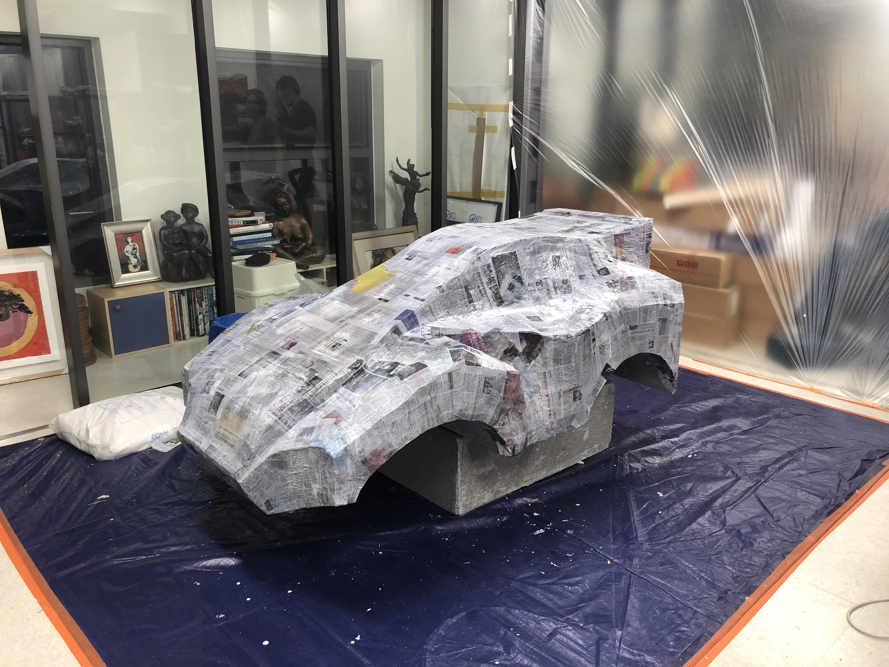
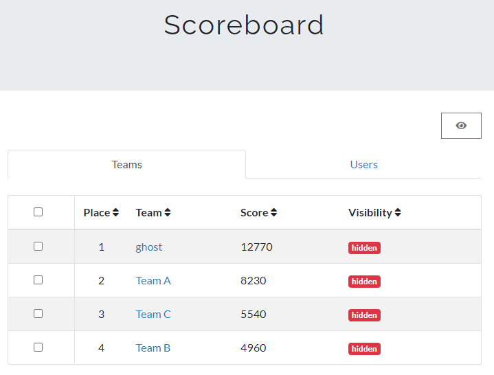
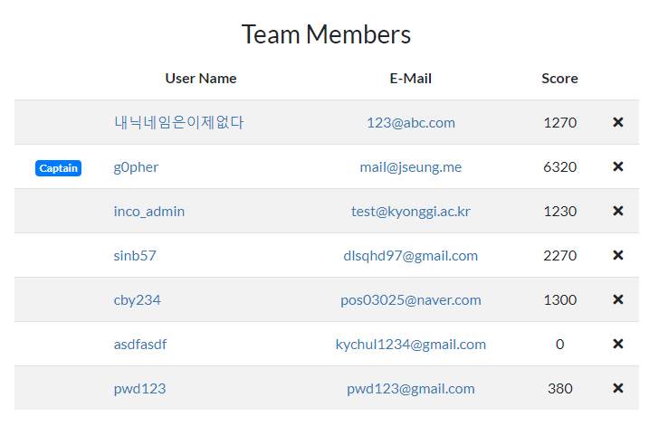
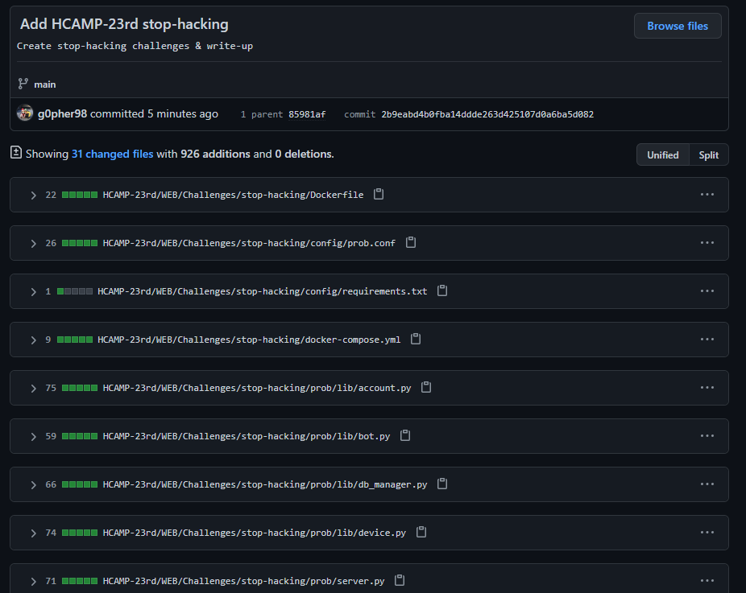
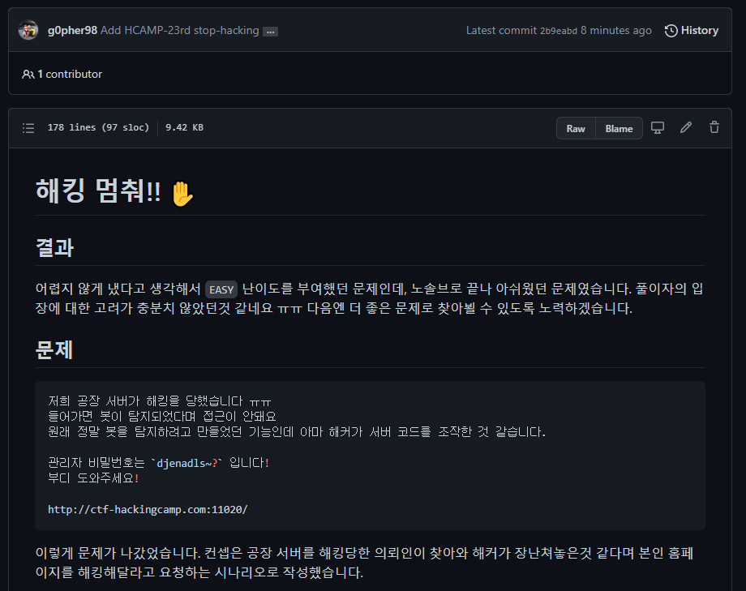
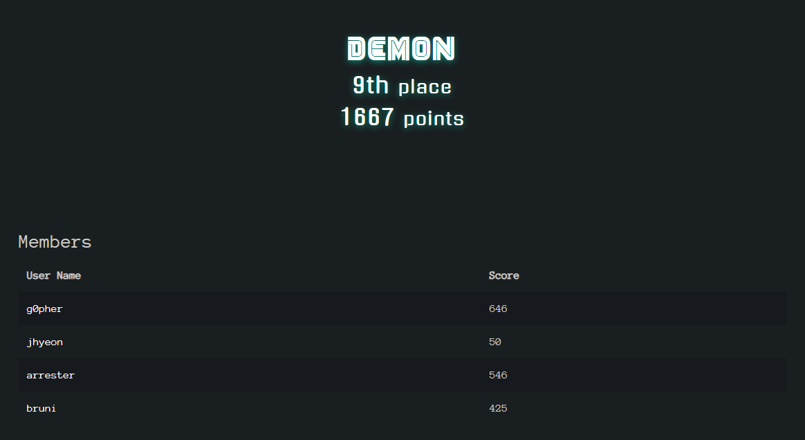
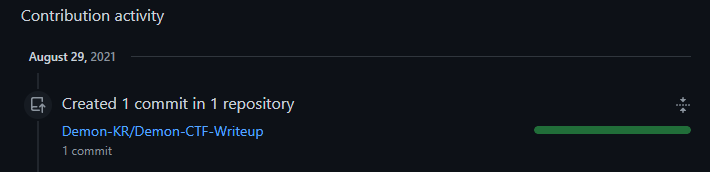

# 2021년 08월

## Day 21
1. Demon 회의
2. KUCIS 프로젝트 회의
3. KUCIS 프로젝트 스캐너 코드 추가   
    - https://github.com/g0pher98/BTS/commit/95d843fa

## Day 22
1. 자율주행자동차 카울 제작  
    - 
2. Demon 팀 github 페이지 생성 + 커스텀 테마 기반 구성  
    - https://github.com/Demon-KR/Demon-KR.github.io/commit/59f9a632
    - https://github.com/Demon-KR/Demon-KR.github.io/commit/569960c6

## Day 23
1. 노원 을지병원에서 CT촬영.
2. 자율주행차 디자인 회의
3. 자율주행차 개발 회의
4. Demon 팀 github 페이지 기존 코드 버리고, 디자인 욕심 버리고 그냥 심플하게 변경
    - https://github.com/Demon-KR/Demon-KR.github.io/commit/ec05a2e62

## Day 24
1. K.knock 웹공방전 시작
2. Demon 팀 github 페이지 메인과 sub 페이지 css 분리
    https://github.com/Demon-KR/Demon-KR.github.io/commit/5e9824b5c

## Day 25 (벌금)
1. 풀타임 K.knock 웹공방전

## Day 26
1. K.knock 웹공방전 마무리
    
    
2. 화이자 1차 접종😎😎
3. 23th HackingCamp CTF에 출제했던 문제 업로드 및 Write-up 작성
    (Demon팀 private repo)
    
    

## Day 27
1. 전산정보원 마지막 근로
2. Demon 팀 github 페이지 각 멤버 card 형태로 분리
    https://github.com/Demon-KR/Demon-KR.github.io/commit/24c0f9cd13bf

## Day 28 (벌금)
1. 경기대학교 소프트웨어중심대학 서포터즈 SWAT 교육 기자재 실습 및 커리큘럼 제작
2. C-Lab & K.knock 공동회의
3. wormcon CTF

## Day 29
1. wormcon CTF 종료. 최종 8등!
    
2. wormcon CTF 문제 Demon 레포에 정리
    