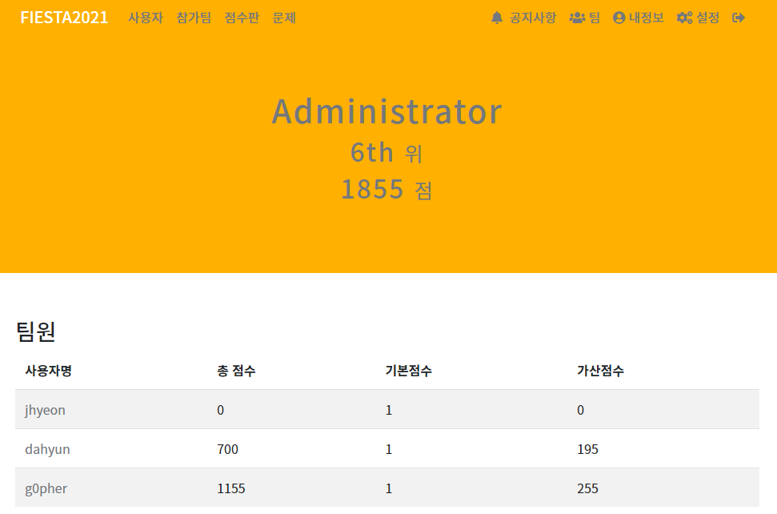
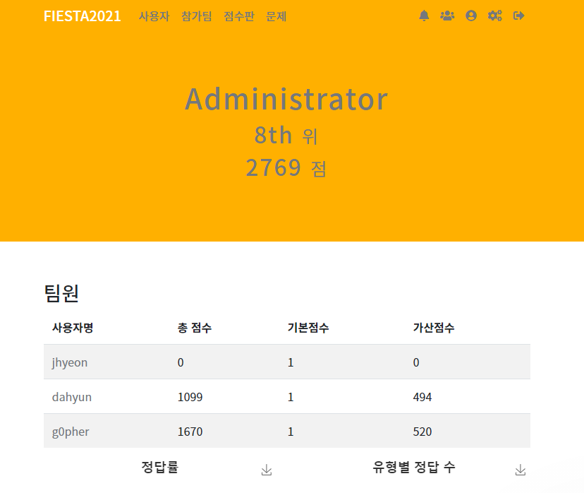
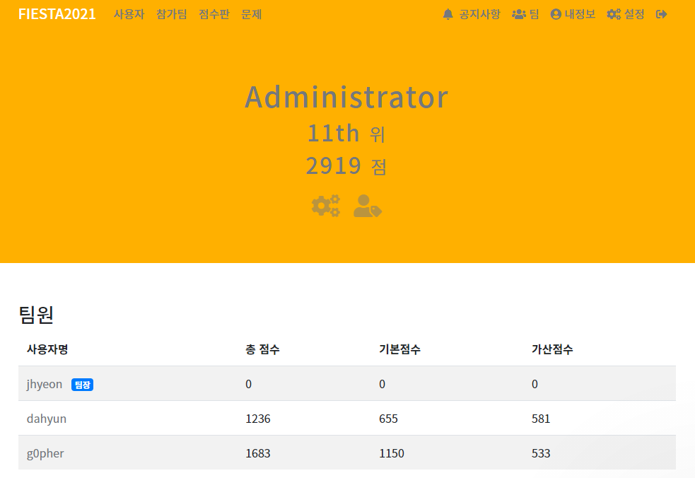

# 2021년 09월

## Day 1
1. 블루투스 해킹 - bleedingtooth - badchoice 공격 공부 및 정리 ([링크](https://github.com/g0pher98/WIL/blob/main/security/wireless/bleedingtooth-badchoice.md))
  https://github.com/g0pher98/WIL/commit/6d3d36118d7c87c31ebf14a9945
2. 김희열 교수님과 데이트
3. 소중대 서포터즈 SWAT 팀장 대면 회의

## Day 2
1. 데몬팀 페이지 개인링크(sns, blog) 추가  
  https://github.com/Demon-KR/Demon-KR.github.io/commit/52c591055ac
2. 금보원 지난 대회 writeup 공부 (내일부터 2주간 대회)

## Day 3, 4, 5
1. 금융보안원 피에스타 진행중.

## Day 6
1. 금융보안원 피에스타 진행중.
    
  진행중에 맞이한 오류는 정리.
  - https://github.com/g0pher98/Oops/commit/6132ee86ea3ddd1b413c1
  - https://github.com/g0pher98/Oops/commit/11eb3644fe10a47452f0d
2. 자율주행 프로젝트 회의
3. 버그바운티 스터디 회의

## Day 7, 8, 9
1. 금융보안원 피에스타 진행중.  

너무,,, 어렵드아,, 
2. 자율주행 YOLOv5 커스텀 데이터셋으로 학습

## Day 10
1. 자율주행 프로젝트 5차 테스트 주행 직전 밤샘작업.  

## Day 11
1. K.knock에서 화이트햇 CTF 참여  
    
  확실히 사이버사 문제는 난이도가 높음,,, 그런데도 금방금방 푸는 사람들 보면 갈길이 멀다  

2. Demon팀에서 CSAW 2021 CTF 참여  
    
  CSAW는 문제 나오기만 하면 150팀 정도가 바로 풀어버림,, 대회 규모가 있다보니 더 자극받긴 하는데, 규모에 비해 문제 퀄리티가 좀,,,;; 불-편

*P.S. 강의 지금까지 1개밖에 안들음,,ㅠ 이번 주말에 몰아서 볼예정*

## Day 12
1. CSAW, 화이트햇 2021 CTF 끝
2. 학교 강의 내용 정리
  - https://github.com/g0pher98/WIL/commit/b9f3a13b4cd4c35fcb7ab2f3ab5ac12d5cd6f183

